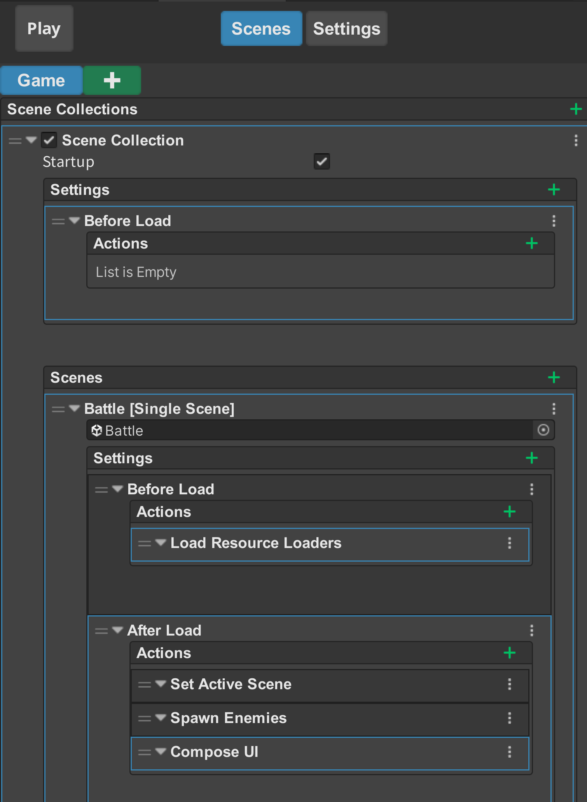
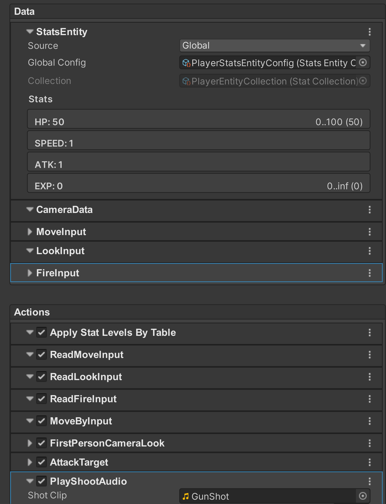
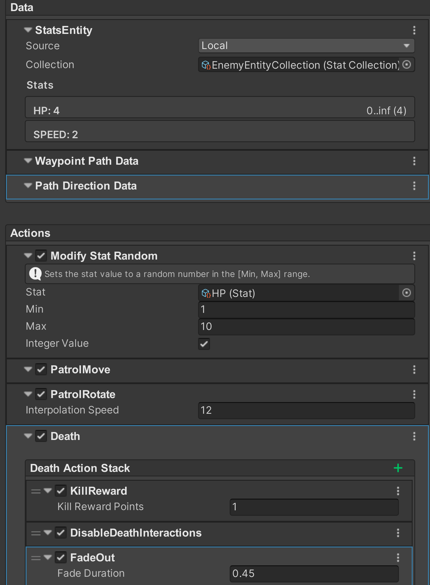
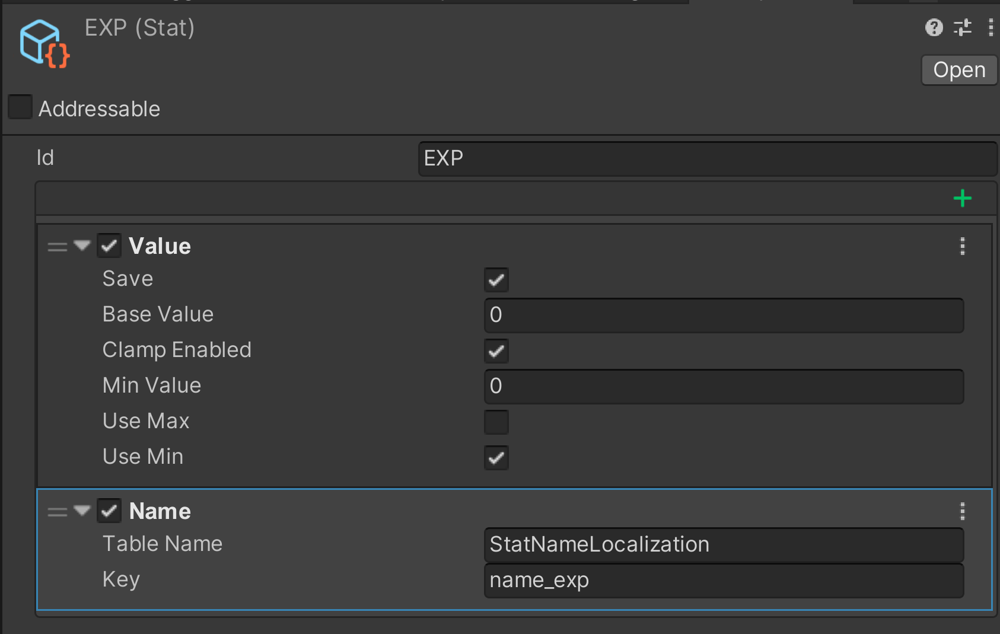
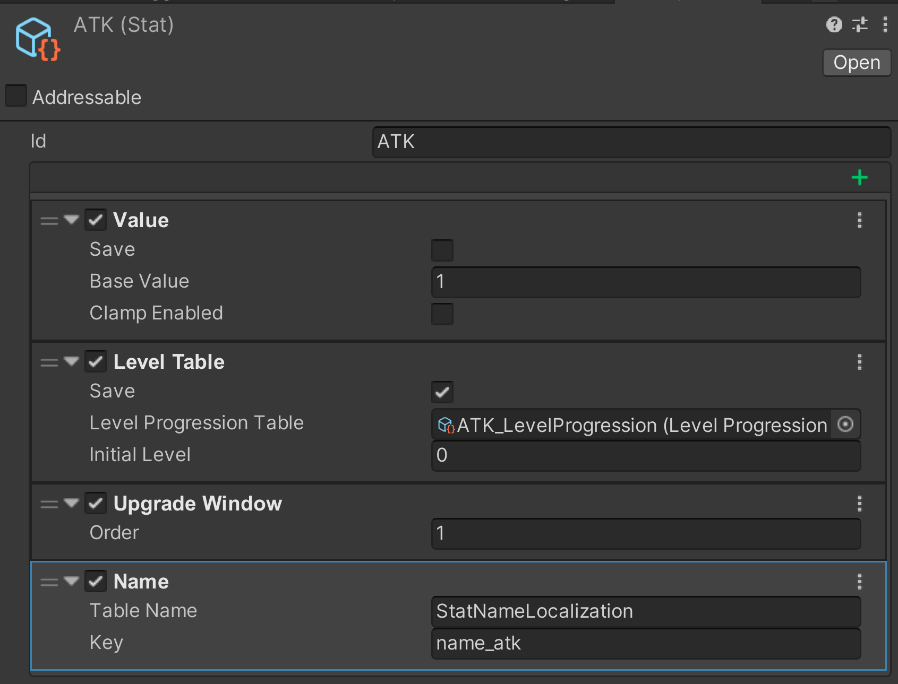
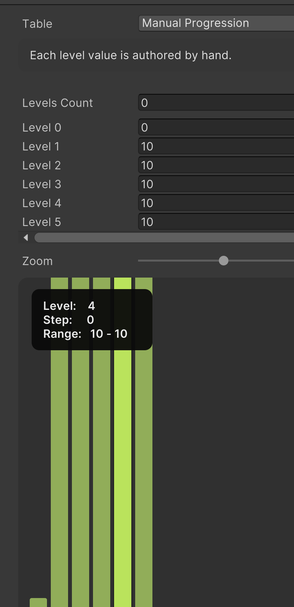
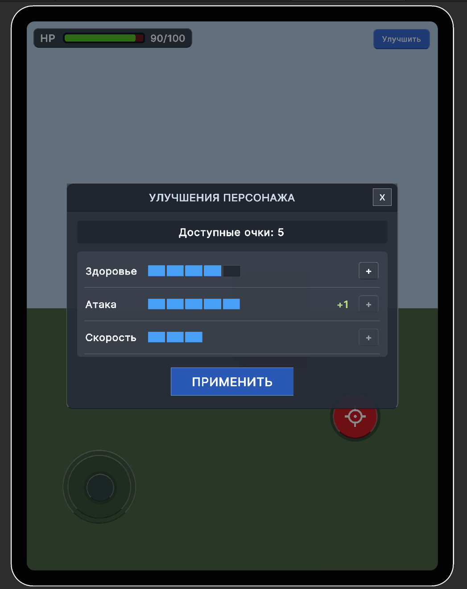
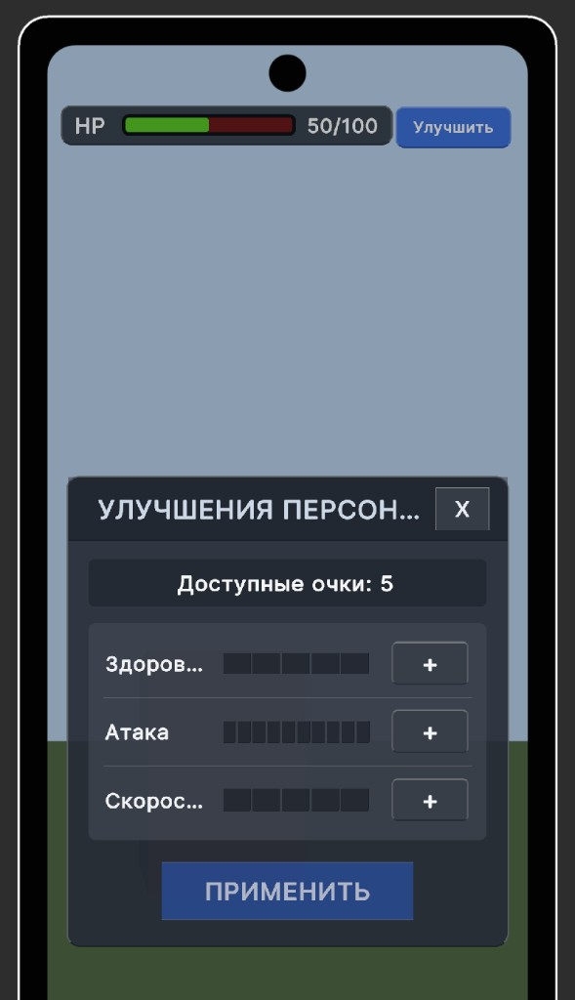
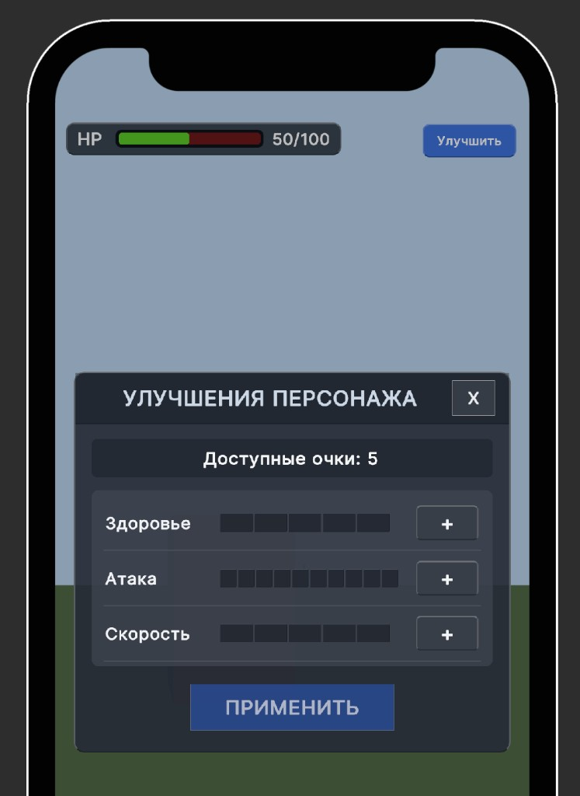

- Видео геймплея: https://youtu.be/uXD4HFMA-ck
- Билд: https://drive.google.com/file/d/15z0wJ5YjUkUvmIg06pOqkqSFNOWz6S3l/view?usp=sharing

Видео записано в редакторе. В билде шейдер врагов, отвечающий за эффект затухания после смерти, отображается розовым, хотя сам шейдер добавлен в билд, а в реакторе такой проблемы нет. Пробовал переписать шейдер, но причину на данный момент не успел понять.

## 1. Базовая архитектура папок и сборок

Проект организован вокруг `Assets/Assemblies`, где каждый доменный блок вынесен в отдельную assembly.

Типовая структура внутри assembly:
- `Content` — сцены, префабы, ScriptableObject-конфиги, UI-ассеты.
- `Runtime` — runtime-код, участвующий в игре.
- `Editor` — редакторские инструменты и расширения.

### 1.1 Пакет личных фреймворков

Проект опирается на мой UPM-пакет `Packages/com.vladislavtsurikov.frameworks`, который содержит базовые строительные блоки архитектуры.

### 1.2 Разделение на asmdef

Разделение на отдельные `asmdef` сделано, чтобы развести ответственность модулей и упростить дальнейшее развитие.

- `Assets/Assemblies/ShooterUpgradePrototype/ShooterUpgradePrototype.asmdef` (`ShooterUpgradePrototype`) — базовый gameplay-модуль с основной логикой игры. Здесь находятся игрок, враги, UI, сервисы, конфиги и интеграция доменной логики в runtime.
- `Assets/Assemblies/Stats/Stats.asmdef` (`Stats`) — модуль системы статов. Система не создавалась с нуля под этот проект: была переиспользована ранее разработанная stat-система, которая уже применялась в нескольких проектах. Она изначально спроектирована как расширяемая и позволяет удобно создавать новые статы без изменения существующего кода. Поддерживает модификаторы значений, эффекты и бафы, а также интеграцию с таблицами прогрессии.
- `Assets/Assemblies/LevelProgression/LevelProgression.asmdef` (`LevelProgression`) — модуль прогрессии уровней. Отвечает за хранение таблиц уровней, вычисление cumulative значений и используется для реализации системы апгрейдов.
- `Assets/Assemblies/Input/Input.asmdef` (`Input`) — модуль обработки пользовательского ввода. Инкапсулирует работу с Input System и предоставляет унифицированный слой данных для gameplay-логики.
- `Assets/Assemblies/InputMode/InputMode.asmdef` (`InputMode`) — модуль переключения режимов ввода. Позволяет абстрагировать различия между Desktop и Mobile управлением и централизованно управлять текущим режимом.
- `Assets/Assemblies/MobileInputUI/MobileInputUI.asmdef` (`MobileInputUI`) — модуль UI для мобильного управления. Содержит визуальные элементы управления (джойстики, кнопки) и интеграцию с системой ввода.
- `Assets/Assemblies/FirstPersonCamera/FirstPersonCamera.asmdef` (`FirstPersonCamera`) — модуль камеры от первого лица. Вынесен отдельно, чтобы изолировать логику камеры от gameplay и упростить её замену или расширение.
- `Assets/Assemblies/UIRootSystem/UIRootSystem.asmdef` (`UIRootSystem`) — интеграция с UISystem asmdef. Представляет собой базу для построения сложного UI, включающего экраны, попапы и HUD. Позволяет добавлять интерфейсы в заранее определённые родительские контейнеры (например, отдельные слои под попапы, HUD или основные экраны). Такой подход хорошо масштабируется и ранее использовался в проекте с большим количеством интерфейсов и сложной UI-структурой, где было множество экранов, попапов и элементов HUD.
- `Assets/Assemblies/WaypointsSystem/WaypointsSystem.asmdef` (`WaypointsSystem`) — она используется для движения врагов по заданной линии между точками. В рамках этого проекта система не создавалась, а была переиспользована из другого проекта. Дополнительно система используется как основа для спавна врагов непосредственно на путях.
- `Assets/Assemblies/WaypointPathEntitySpawner/WaypointPathEntitySpawner.asmdef` (`WaypointPathEntitySpawner`) — модуль спавна сущностей на waypoint-путях. Позволяет переиспользовать сам подход спавна и отдельно расширять правила выбора пути, capacity и позиции спавна.
- `Assets/Assemblies/SceneManagerIntergration/ArmyClash.SceneManager.asmdef` (`ArmyClash.SceneManager`) — интеграционный bootstrap-модуль на базе `SceneManagerTool`. Содержит операции, которые выполняются при старте игры: загрузка resource loaders, биндинг конфигов и начальный спавн врагов после загрузки сцены.

## 2. Технологический стек и каркас

- **Zenject**
  Используется для DI и архитектуры зависимостей: внутри класса не нужно вручную искать зависимости, они приходят через контейнер.
  Через `Zenject` в проекте создаются и связываются сервисы, системы ввода, спавнеры, bootstrap-операции и runtime-конфиги.

- **UniRx**
  Выбран как оптимизационный реактивный инструмент: логика выполняется по событию, а не через постоянные проверки условий в `Update`.
  Используется для работы с вводом, состояниями, статами, апгрейдами и UI-синхронизацией.

- **EntityDataAction**
  Выбран как основной подход к построению gameplay-логики: код получается расширяемым и собирается из `ComponentData` и `Action`.
  Сущности в проекте строятся через `EntityMonoBehaviour`, `ComponentData` и `EntityMonoBehaviourAction`.
  Плюсы такого подхода в этом проекте: можно точечно отключать отдельные `Action` и быстро проверять влияние на поведение, добавлять debug-блоки вроде `OnDrawGizmos`, переиспользовать готовые data/action-элементы и не решать всё через большое наследование и дублирование.
  Такой подход ускоряет создание механик, но увеличивает количество файлов.

- **UI Toolkit**
  Используется для UI.

- **AddressableLoaderSystem**
  Выбран для загрузки/биндинга конфигов: конфиги поднимаются через Addressables до старта боя, автоматически биндятся в Zenject и корректно выгружаются, это мощный инструмент для автоматической загрузку и выгрузки, также позволяет множество конфигов загружать батчами паралельно. Хоть в проекте через него загружается один конфиг, я решил его добавить, как основу архитектуры проекта

- **SceneManagerTool**
  Выбран как bootstrap-точка входа в игру: через `Play` выполняется управляемый конвейер старта с операциями до и после загрузки сцены. Это уже готовая bootstrap реализация, она очень расширяемая и аналогов по вохможностям не видел

- **UISystem**
  Используется как базовый слой для UI, построенный на паттерне MVP. Разработчик создаёт Presenter, наследуясь от `UIPresenter`, и может задавать ему родителя, формируя дерево интерфейсов в глубину с неограниченным количеством вложенных Presenter. Инициализация происходит сверху вниз: пока родитель не активирован, дочерние Presenter не инициализируются. UI можно открывать как извне, так и из других `UIPresenter`. Также система позволяет управлять моментом загрузки префабов или `UIDocument` через Addressables.

## 3. Точка запуска и bootstrap-поток

Старт игры в редакторе выполняется через `SceneManagerTool`, через кнопку `Play` в окне `Scene Manager`.

Окно открывается через путь:
- `Window -> Vladislav Tsurikov -> Scene Manager`

Этот подход был выбран не только как способ запуска сцены, но и как расширяемая точка инициализации игры. `SceneManagerTool` достаточно мощный для более крупных проектов: он даёт более удобный способ работать со сценами, управлять bootstrap-процессом и постепенно наращивать пайплайн инициализации без превращения старта игры в набор случайных вызовов из разных мест.

При таком запуске используется конвейер операций `SceneManager`:

`BeforeLoad`: выполняется `LoadResourceLoadersOperation` — загружаются нужные конфиги и resource loaders до загрузки целевой сцены.

`AfterLoad`: выполняется `SpawnEnemiesOperation` — вызывается стартовый спавн врагов до `MaxMobCount`.

Скриншот bootstrap-инструмента:

  

## 4. Архитектура данных и поведения

### 4.1 Entity-уровень

В проекте есть две основные gameplay-сущности:
- `PlayerEntity`
- `EnemyEntity`

Обе сущности не содержат "большой контроллер". Они создают набор `ComponentData` и `Action`, из которых собирается итоговое поведение.

### 4.2 Игрок

`PlayerEntity` создаёт данные:
- `StatsEntityData`
- `CameraData`
- `MoveInputData`
- `LookInputData`
- `FireInputData`

И набор action:
- `ApplyStatLevelsByTableAction`
- `ReadMoveInputAction`
- `ReadLookInputAction`
- `ReadFireInputAction`
- `MoveByInputAction`
- `DesktopFirstPersonCameraLookAction`
- `MobileFirstPersonCameraLookAction`
- `AttackTargetAction`
- `PlayShootAudioAction`

Роли этих action:
- `ApplyStatLevelsByTableAction` применяет значения статов из таблицы прогрессии;
- `ReadMoveInputAction`, `ReadLookInputAction`, `ReadFireInputAction` читают ввод и записывают его в соответствующие Data;
- `MoveByInputAction` перемещает игрока на основе ввода и статов;
- `DesktopFirstPersonCameraLookAction`, `MobileFirstPersonCameraLookAction` управляют поворотом камеры в зависимости от платформы;
- `AttackTargetAction` обрабатывает стрельбу;
- `PlayShootAudioAction` воспроизводит звук выстрела.

Скриншот `PlayerEntity` в инспекторе:

  

### 4.3 Противники

`EnemyEntity` создаёт данные:
- `StatsEntityData`
- `WaypointPathData`
- `WaypointPathDirectionData`

И action:
- `ModifyStatRandomAction`
- `PatrolMoveAction`
- `PatrolRotateAction`
- `DeathAction`

Роли:
- `ModifyStatRandomAction` модифицирует статы врага (например, добавляет вариативность);
- `PatrolMoveAction` двигает врага по waypoint-пути;
- `PatrolRotateAction` синхронизирует поворот с движением;
- `DeathAction` обрабатывает смерть врага.

Скриншот `EnemyEntity` в инспекторе:

  

### 4.4 Почему выбран такой подход

В вакансии написано, что будет большим плюсом опыт работы с ECS, это мой первый опыт использования этого фреймворка именно для gameplay-логики, хотел расширить свои знания в таком подходе программирования, для ТЗ, в плане расширяемости, он очень годится. До этого у меня уже был опыт с `DOTS`, а сам этот подход раньше применялся для сложного UI на `Unity UI Canvas`, где он помогал переиспользовать блоки кода в другом UI и ускорял разработку.

По сути это ECS-подход. В классическом ECS поведение обычно уходит в `System`, который нельзя настраивать в Inspector. Здесь эту роль выполняет `Action`: его можно конфигурировать прямо в Inspector и быстрее собирать логику в строгих архитектурных рамках, позволяет не задуматься, что где-то будет дублирование логики. Также этот подход позволил быстрее сделать тестовое, смог часть логики перенести в этот проект.

Дополнительно система удобна тем, что `ComponentData` может становиться "грязным": если `Action` или сторонний код меняет данные, автоматически вызывается зависимый `Action`. Это упрощает реактивное поведение, хорошо работает для UI и позволяет тестировать часть логики в `EditMode` без запуска `PlayMode`. Ещё один практический плюс — у каждого `Action` можно отдельно включать `OnDrawGizmos`, что удобно для отладки и настройки конкретной логики.

## 5. Архитектура статов и конфигов

Система статов в проекте не создавалась с нуля, а была переиспользована из ранее разработанного решения, которое уже применялось в нескольких проектах.

Статы построены как отдельная расширяемая система:
- каждый стат представляет собой отдельную сущность;
- поддерживаются модификаторы значений;
- можно добавлять эффекты и бафы;
- есть интеграция с таблицами прогрессии (`LevelProgression`).

### 5.1 Очки прокачки через EXP

В роли очков прокачки используется стат **`EXP`**:
- `EXP` не вынесен в отдельную систему для окна апгрейдов;
- это такой же stat из общей системы **Stats**, как `HP`, `ATK` и `SPEED`;
- stat `EXP` входит в набор статов игрока и добавлен в `PlayerEntity` через общий `StatsEntityConfig`.

- за убийство врага игрок получает `+1 EXP`;
- доступное количество очков в окне апгрейдов читается из текущего значения `EXP`;
- при применении апгрейдов нужное количество очков списывается тоже из `EXP`.

На уровне конфигов это видно в `EXP.asset`: у стата включён `Save`, поэтому накопленный `EXP` сохраняется между сессиями тем же механизмом, что и другие stat-данные.

  

Для улучшаемых характеристик, например `ATK`, отдельно настраивается `Level Table` с включённым `Save`. Это означает, что сохраняется уже не просто текущее value, а применённый уровень стата.

  

### 5.2 Сохранение между сессиями

Прогресс игрока сохраняется между сессиями на уровне самой stat-системы, а не отдельным "save manager" для окна апгрейдов.

В проекте сохраняются:
- **уровни улучшаемых статов** (`HP`, `ATK`, `SPEED`);
- **значение `EXP`**, которое используется как доступные очки прокачки.

Сохранение включается через поле **`Save`** у stat-компонентов в конфиге. Если у компонента включён `Save`, runtime-данные автоматически восстанавливаются при старте и записываются при изменении значения.

Технически это устроено так:
- `RuntimeStatLevelData` сохраняет **уровень стата** в `PlayerPrefs` по ключу вида `{StatId}Level`;
- `RuntimeStatValueData` сохраняет **числовое значение стата** в `PlayerPrefs` по ключу вида `{StatId}Value`.

За счёт этого после перезапуска игры:
- уровни прокачанных статов остаются прежними;
- накопленный `EXP` также восстанавливается;
- при инициализации entity stat-система поднимает runtime-состояние из сохранённых данных.

### 5.3 Таблицы прогрессии

Таблица прогрессии задаёт, какое итоговое значение получает stat на каждом уровне. Для `HP`, `ATK` и `SPEED` используются отдельные `LevelProgression`-assets, поэтому баланс можно менять без правок кода.

В проекте используется `Manual Progression`: каждое значение уровня авторится вручную в инспекторе.

  

### 5.4 Конфиги проекта

- `Assets/Assemblies/ShooterUpgradePrototype/Content/Configs/EnemySpawnConfig.asset` — конфиг спавна врагов: задаёт задержку респавна и максимальное количество врагов.

- `Assets/Assemblies/ShooterUpgradePrototype/Content/Configs/PlayerStatsEntityConfig.asset` — конфиг игрока, определяет набор статов и их начальные значения.

- `Assets/Assemblies/ShooterUpgradePrototype/Content/Configs/Stats/Player/ATK.asset` — стат урона игрока.
- `Assets/Assemblies/ShooterUpgradePrototype/Content/Configs/Stats/Player/HP.asset` — стат здоровья игрока.
- `Assets/Assemblies/ShooterUpgradePrototype/Content/Configs/Stats/Player/SPEED.asset` — стат скорости игрока.
- `Assets/Assemblies/ShooterUpgradePrototype/Content/Configs/Stats/Player/EXP.asset` — стат опыта игрока.

- `Assets/Assemblies/ShooterUpgradePrototype/Content/Configs/Stats/Enemy/HP.asset` — стат здоровья врага.
- `Assets/Assemblies/ShooterUpgradePrototype/Content/Configs/Stats/Enemy/SPEED.asset` — стат скорости врага.

- `Assets/Assemblies/ShooterUpgradePrototype/Content/Configs/LevelProgression/Player/ATK_LevelProgression.asset` — таблица прогрессии урона.
- `Assets/Assemblies/ShooterUpgradePrototype/Content/Configs/LevelProgression/Player/HP_LevelProgression.asset` — таблица прогрессии здоровья.
- `Assets/Assemblies/ShooterUpgradePrototype/Content/Configs/LevelProgression/Player/SPEED_LevelProgression.asset` — таблица прогрессии скорости.

- `Assets/Assemblies/ShooterUpgradePrototype/Content/Configs/StatsCollections/PlayerEntityCollection.asset` — набор статов игрока.
- `Assets/Assemblies/ShooterUpgradePrototype/Content/Configs/StatsCollections/EnemyEntityCollection.asset` — набор статов врага.

## 6. UI: логика, масштабирование и локализация

### 6.1 Логика UI (UISystem + MVP)

UI в проекте построен на связке **UISystem** + **UI Toolkit** и следует MVP-подходу:

- **Presenter (Handler)**: класс, который управляет жизненным циклом UI, подписками и данными. Примеры:
  - `BattleHUDRootPresenter` — поднимает HUD и встраивает его в `RootSlots.HudRoot`.
  - `UpgradeWindowPresenter` — открывает окно апгрейдов, блокирует gameplay-ввод, создаёт динамические строки статов и применяет черновые апгрейды.
- **View**: `BindableVisualElement` (или наследник `Button`), который хранит ссылки на элементы из UXML, прокидывает события кликов и обновляет визуальное состояние. Примеры:
  - `UpgradeWindowView` — кнопки `Apply/Close`, бэкдроп, заголовок, локализованный текст.
  - `UpgradeStatRowView` — строка стата: название, сегменты уровня, дельта и кнопка `+`.
- **LayoutLoader**: адресуемая загрузка UXML/USS по адресу (например, `BattleHUD`, `UpgradeWindow`).

### 6.2 Масштабирование/адаптивность UI Toolkit

Скриншоты адаптивности (разные варианты экранов):

  
  
  

### 6.3 Локализация

В Unity 2022.3 нет полноценной “из коробки” поддержки Unity Localization для привязки текстов в **UI Toolkit** так же удобно, как для `Unity UI`.
Поэтому в этом проекте локализация сделана **кодом во View**:

- даже **статические** элементы (заголовки, кнопки) выставляются из `LocalizationSettings.StringDatabase` при инициализации View;
- используется таблица `UILocalization` и ключи вида `upgrade.window.title`, `upgrade.window.apply`, `hud.open-upgrade`.

Это решение **не идеальное** (хотелось бы декларативную привязку на уровне UXML/локализованных компонентов).

## 7. Поддержка Desktop и Mobile управления

Поддержка двух режимов ввода в проекте построена не через две отдельные gameplay-ветки, а через общий input-pipeline с разными источниками ввода.

### 7.1 Общая схема

В проекте есть единый `InputActionAsset` `PlayerInputActions`, в котором описаны три gameplay-действия:
- `Move`
- `Look`
- `Fire`

Для них заведены две группы биндов:
- `Desktop`
- `Mobile`

На уровне `controlSchemes` это выглядит так:
- `Desktop` использует `Keyboard + Mouse`;
- `Mobile` использует `Touchscreen` и опциональный `Gamepad`.

Практически это означает следующее:
- на **Desktop** движение читается с `WASD`, обзор с `Mouse delta`, выстрел с `Mouse left button`;
- на **Mobile** движение читается с `Gamepad leftStick`, обзор с `Touchscreen primaryTouch delta` и `Gamepad rightStick`, выстрел с `Gamepad buttonSouth`.

### 7.2 Зачем нужен InputModeService

`InputModeService` нужен для определения, каким типом устройства игрок пользуется в данный момент.

Он различает три состояния:
- `KeyboardMouse`
- `Gamepad`
- `Touch`

Сервис нужен не для чтения самих значений input, а для определения текущего **input mode** на уровне игрока. Это позволяет другим системам понимать, какой способ управления сейчас активен, и под него подстраивать поведение интерфейса и gameplay-слоя.

Основная идея работы такая:
- если игрок на ПК начал использовать клавиатуру или мышь, текущим режимом становится `KeyboardMouse`;
- если затем он нажал кнопку на физическом геймпаде, режим переключится на `Gamepad`;
- если после этого он снова начнёт пользоваться клавиатурой или мышью, режим вернётся на `KeyboardMouse`;
- на мобильном устройстве режим по умолчанию будет `Touch`, но если подключён физический геймпад и именно он начинает использоваться, приоритет перейдёт к `Gamepad`.

### 7.3 Desktop и Mobile режимы

И desktop, и mobile-управление в проекте работают через общий `Input System`.

В desktop-режиме клавиатура и мышь читаются напрямую через `PlayerInputActions`.
В mobile-режиме поверх этого добавляется `MobileInputUI` с экранными контролами: виртуальным стиком и кнопкой выстрела.

При этом дальше обе ветки сходятся в общий gameplay-pipeline: ввод переводится в единые данные игрока, и уже от них работают движение, камера и стрельба. За счёт этого gameplay-логика не дублируется под разные платформы.

Дополнительно мобильный HUD показывается только тогда, когда текущий `InputMode` определяется как `Touch`, поэтому desktop и mobile интерфейс не смешиваются между собой.

### 7.4 Как mobile UI попадает в gameplay input

Мобильный UI не пишет данные напрямую в gameplay.

Вместо этого он эмулирует виртуальное устройство через `MobileVirtualInputService`, а дальше весь ввод проходит через тот же `Input System`, что и desktop-управление. Это позволяет держать единый pipeline чтения input для всех режимов.

### 7.5 Почему камера работает и для Desktop, и для Mobile

Для камеры используется единый `FirstPersonCameraLookAction`.

Desktop и mobile не разводятся на две отдельные gameplay-системы: различие остаётся на уровне входных данных, а сама логика поворота камеры общая. За счёт этого поддержка нескольких режимов ввода не дублирует camera gameplay-код.
